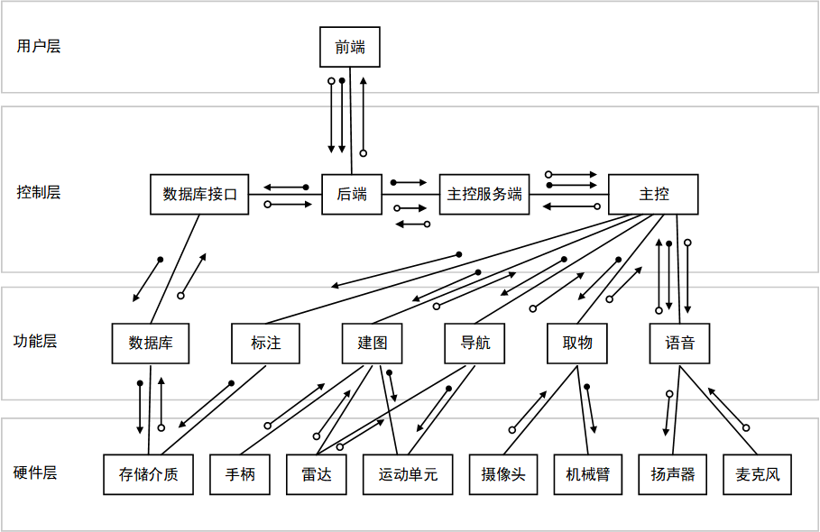

# 2023软件工程——补丁嵌入队

## 项目概述

随着人工智能、计算机和机器人操作系统ROS的飞速发展和进步，机器人逐渐向生活化、服务化的方向发展，应用范围不断扩大。目前市场上已经出现了很多类型的机器人，例如可以自动识别房间地形、完成清扫任务的扫地机器人，以及帮助人类寻路的导航机器人。2022年末，chatGPT的出现也预示着机器人又将迎来一次发展的热潮。

本项目将开发一种智能家庭服务机器人。它可以实现语音控制、取物送物、自动建图、路径规划、动态避障等功能，并具有美观的人机交互界面。该机器人将在家政服务中具有通用性，实现在多种场景下的服务需求，同时促进相关的进一步研究。

## 项目成员

补丁嵌入队的成员及分工如下：

| 学号     | 姓名   | 分工                       |
| :------- | :----- | -------------------------- |
| 20373159 | 李国玮 | 项目组长，后端和数据库开发 |
| 20373276 | 王子豪 | 需求分析师，导航和语音     |
| 20373146 | 景泓斌 | 系统架构师，ROS主控设计    |
| 20373142 | 高渤宇 | 测试人员，前端开发         |
| 20373969 | 刘子奇 | 测试人员，建图和标注       |

## 项目介绍

### 硬件结构


### 系统结构

#### 文件目录

```bash
├── backend							# 后端代码
├── docs								 # 文档
├── images							  # 展示图片
├── ros_web							# 前端代码
├── src										# ROS包
│   ├── patch_embedding				   # 主要功能包
│   │   ├── config          # 配置文件
│   │   ├── launch         # launch文件
│   │   ├── maps           # 保存的地图
│   │   ├── marks          # 保存的航点
│   │   ├── scripts			# python代码
│   │   ├── src                 # c代码
│   │   └── srv                 # 自定义服务类型
│   ├── rplidar_ros				                # 激光雷达包（官方包）
│   ├── iai_kinect2								# 相机包（官方包）
│   ├── waterplus_map_tools		  # 标注工具包（官方包）
│   ├── wpb_home							# 机器人功能包（官方包）
│   ├── wpr_simulation					 # 模拟包（官方包）
│   └── xfyun_waterplus					# 语音包（官方包）
└── test								   # 测试脚本
```

#### 系统架构



### 技术介绍

- 前端：`vue`框架，`element-ui`组件库，`axios`数据交互。
- 后端：`django`框架，`pymysql`连接数据库。
- 数据库：`MySQL`。
- 机器人端：`ROS`，主从机，`ssh`。

## 环境配置

### 环境及软件需求

- Ubuntu 18.04 LTS
- ROS Melodic
- python 3.6
- MySQL 5.7

### ROS包的安装

- 相关系统包

```bash
sudo apt-get install ros-melodic-joy
sudo apt-get install ros-melodic-hector-mapping
sudo apt-get install ros-melodic-gmapping
sudo apt-get install ros-melodic-map-server
sudo apt-get install ros-melodic-navigation
sudo apt-get install ros-melodic-move-base
sudo apt-get install ros-melodic-amcl
sudo apt-get install ros-melodic-cv-bridge
sudo apt-get install ros-melodic-audio-common
sudo apt-get install libasound2
sudo apt-get install ros-melodic-sound-play
```

- `wpb_home`包参考：https://github.com/6-robot/wpb_home
- `wpr_simulation`包参考：https://github.com/6-robot/wpr_simulation
- `waterplus_map_tools`包参考：https://github.com/6-robot/waterplus_map_tools
- `rplidar_ros`包参考：https://github.com/robopeak/rplidar_ros
- `iai_kinect`2包参考：https://github.com/code-iai/iai_kinect2


## 功能介绍
